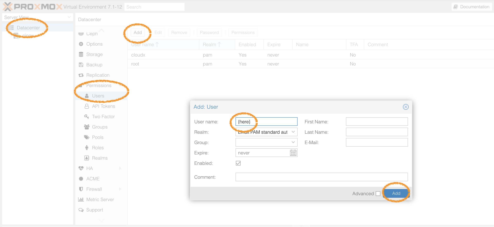
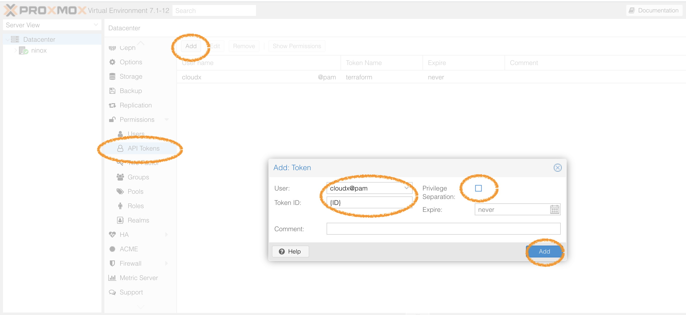
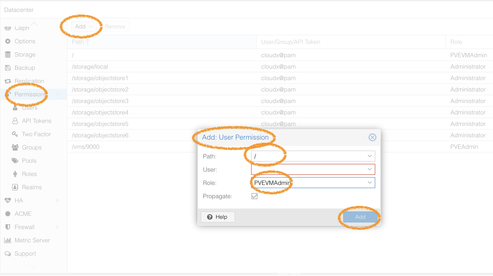
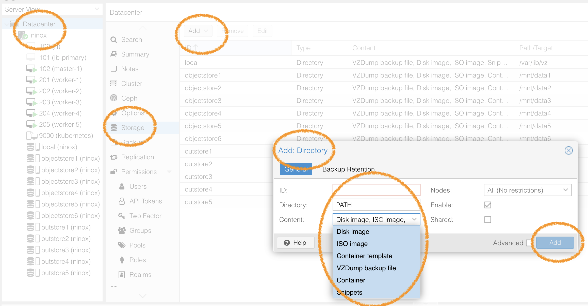

# Prepare
We must have Proxmox and Talos images.
If you did't have Proxmox. See https://ninox-cyber.github.io/portal/proxmox-server-setup-with-iiidevops.pdf from Install Proxmox and Network configuration to Increase Storage. 
## Initialize
Put node config to proxmox/local:snippets.
```
cd talos/talos-v1.0.0/kube_1.22.8/
cp worker.yaml /var/lib/vz/snippets/worker_1_22_8.yaml
cp controlplane.yaml /var/lib/vz/snippets/controlplane_1_22_8.yaml
```

## Cloud init
If we use cloud init, we can set system and files automatically
```
# In proxmox terminal
# create a new VM 
qm create 9000 --memory 2048 --name kubernetes --net0 virtio,bridge=vmbr0

# import the downloaded disk to local-lvm storage , 
# download from : https://github.com/siderolabs/talos/releases  version:1.0.0
qm importdisk 9000 nocloud-amd64.raw local     

# finally attach the new disk to the VM as scsi drive
qm set 9000 --scsihw virtio-scsi-pci --scsi0 local:9000/vm-9000-disk-0.raw

# Add Cloud-Init CD-ROM drive || pass the Cloud-Init data to the VM.
qm set 9000 --ide2 local:cloudinit

# To be able to boot directly from the Cloud-Init image, set the bootdisk parameter to scsi0, and restrict BIOS to boot from disk only. This will speed up booting, because VM BIOS skips the testing for a bootable CD-ROM.
qm set 9000 --boot c --bootdisk scsi0

# Also configure a serial console and use it as a display. Many Cloud-Init images rely on this, as it is an requirement for OpenStack images.
qm set 9000 --serial0 socket --vga serial0

# data ++
qm resize 9000 scsi0 +5G
```

## Authentication
Determine authentication method in Proxmox, we use API keys.
1. create user

2. create API token (privilege不要打勾)

3. remember your token, it will be used in the next step.

4. Go to permission -> Add -> User permission
   Path:/
   User which you create
   Role: PVEVMAdmin
   
5. create again (4.)
   Path: /storage/local
   User which you create
   Role: Administrator

## P.S.
### Create Storage
If we want to create storage by disks, we need mount disk to {PATH}.
```
mkdir {PATH}
mount {DISK} {PATH}
# Check disks
df -l 
```
We use proxmox to create storage manually.
