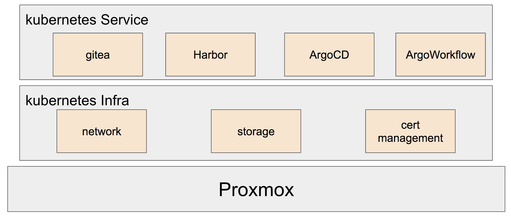

# Edge-Cloud 
## Main
we use terraform to create Vms automatically which os is talos in Proxmox. Then we can deploy many system-deployments,including CI/CD system.
## Dependency
Proxmox : v7.1-12
kubernetes : v1.22.8
helm : v3.8.2
talos : v1.0.0
## Introduction
We will use proxmox to set a few nodes with talos. Then use Kubernetes to manage all service including CI/CD.

### Preparing 
Setting up the config about proxmox environment and node.
>Open 00-Prepare and follow the readme.
### Create Vm
With terraform, we can build node quickly.
>Open 01-VMCluster and follow the readme.
### K8s Infra
On kubernetes, we need to build network,storage and so on.
>Open 02-K8sInfra and follow the readme.
### K8s Service
After infra sets up, We can deploy application on kubernetes.
>Open 03-K8sApp and follow the readme.
### DevOps
When all applications are done, we can test CI/CD and know how it works.
>Open 04-DevOps and follow the readme.